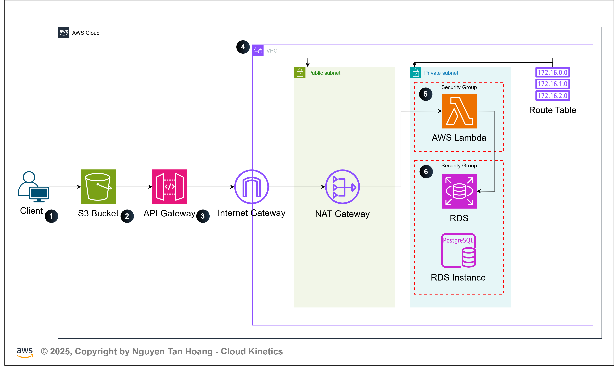

##  Prerequisites
- Node.js >= 18
- Pulumi CLI (npm install -g pulumi)
- AWS CLI configured (aws configure)
- An S3 bucket to store Pulumi state (e.g., pulumi-state-bucket)

## Step-by-Step Setup
### Step 1: Clone the Repo
```sh
git clone https://github.com/HoangGuruu/my-3tier-webapp.git
cd my-3tier-webapp
```
### Step 2: Install Dependencies
```sh
npm install
```
### Step 3: Configure Pulumi to Use S3 Backend
```sh
pulumi login s3://pulumi-state-bucket-name
# Replace pulumi-state-bucket-name with your actual S3 bucket name.
```

## Environment Setup (Dev & Prod)
### Step 4: Create Stack
```yml
pulumi stack init dev
# or
pulumi stack init prod
```
### Step 5: Set Pulumi Config

#### Config Format Example for Pulumi.dev.yaml or Pulumi.prod.yaml

```sh
## Sample config file
encryptionsalt: v1:FNzaJmpd6ko=:v1:ZvCX9BghJCznTG41:ZzxaaT8EEtBNWlHbKnMNvYd4jMP3PQ==
config:
  aws:region: ap-southeast-1
  my-3tier-webapp:vpcCidr: 10.1.0.0/16
  my-3tier-webapp:publicSubnetCidrs: ["10.1.1.0/24", "10.1.2.0/24"]
  my-3tier-webapp:privateSubnetCidrs: ["10.1.3.0/24", "10.1.4.0/24"]
  my-3tier-webapp:bucketName: s3-bucket
  my-3tier-webapp:dbUsername:
    secure: v1:wG5XiSrmgBtRubqJ:4KcP/QCIDZcpnNAkpQ9gbxZ1VkZy+TQw
  my-3tier-webapp:dbPassword:
    secure: v1:Mis9laSA8/mYadVW:XnMdB+KNtL88BEa4hepPzWv6y/3KvvI7d7qW0NaKNA==
  my-3tier-webapp:dbName:
    secure: v1:oiK9OOYYOO0LPtYo:Or0yTVEtROEIc0QgzdQtyv8MZrQd
  my-3tier-webapp:instanceType: db.t3.micro
  my-3tier-webapp:allocatedStorage: "20"

```
#### How to add secret env 
```sh
pulumi config set --secret my-3tier-webapp:dbUsername your-db-username
pulumi config set --secret my-3tier-webapp:dbPassword your-db-password
pulumi config set --secret my-3tier-webapp:dbName your-db-name
```


### Step 6: Deploy the Infrastructure
```sh
# Setup for develop
pulumi stack select dev
pulumi up --yes
# Setup for production
pulumi stack select prod
pulumi up --yes
```


## Outputs
After deployment, Pulumi will output:

- frontendUrl – S3 Static Website URL
- apiEndpoint – Lambda Function URL or API Gateway Endpoint
- dbEndpoint – RDS Endpoint (not exposed publicly)

